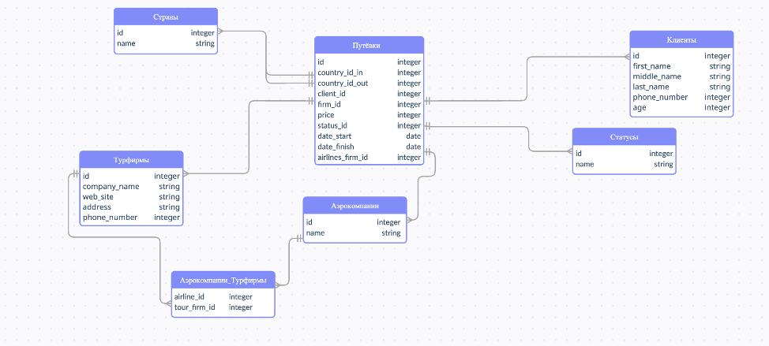
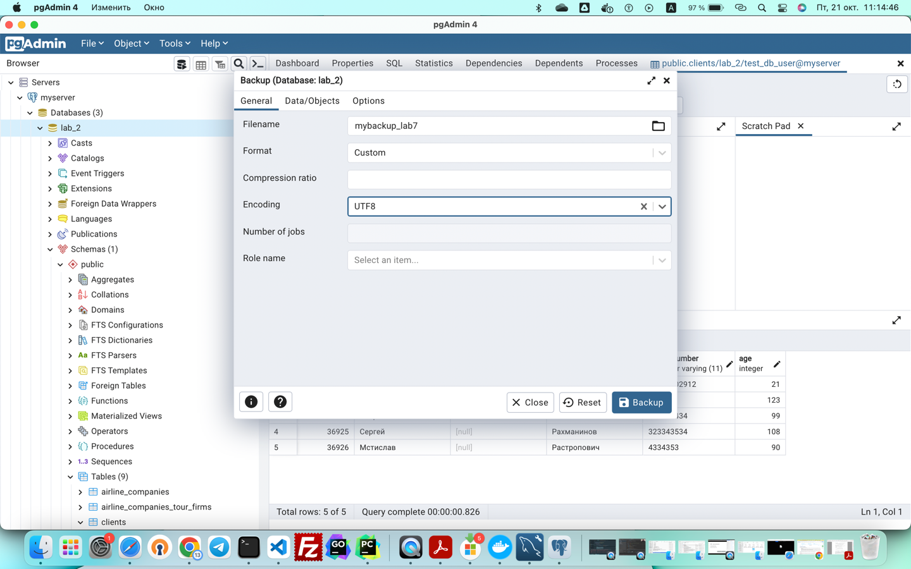
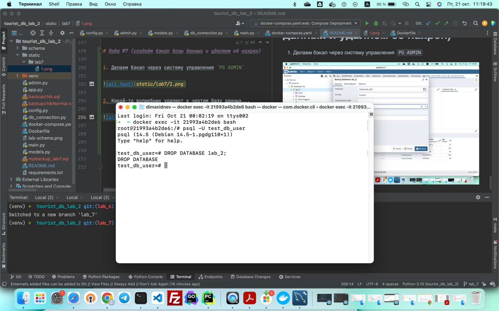
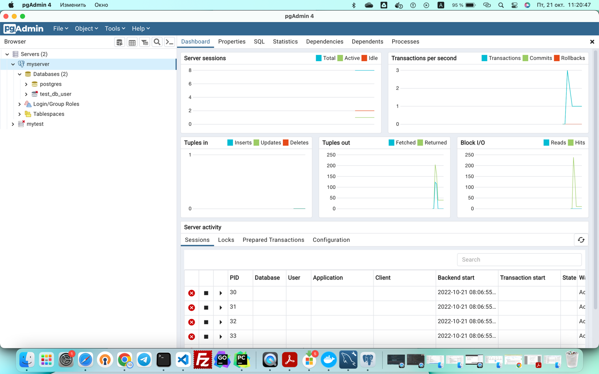
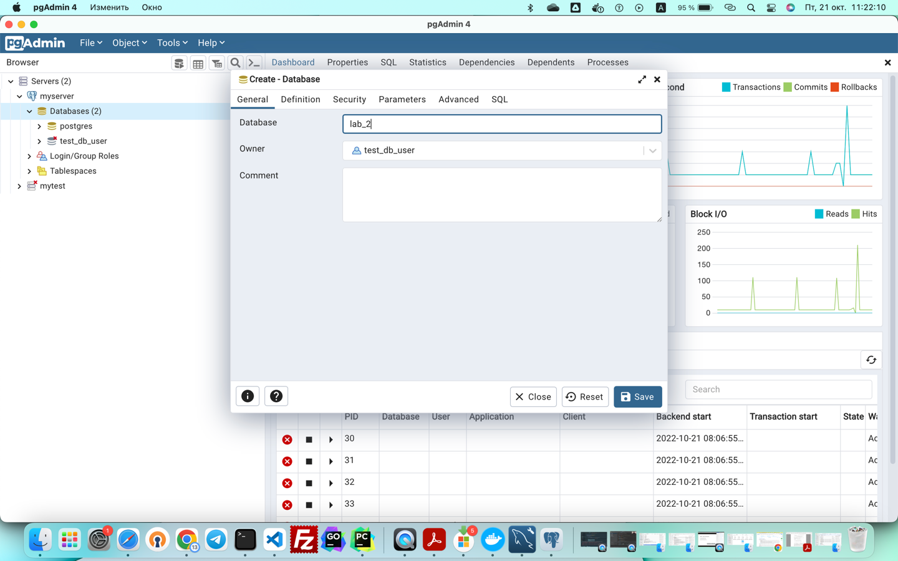
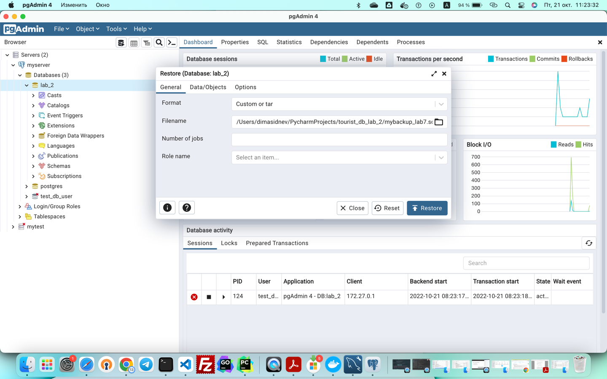
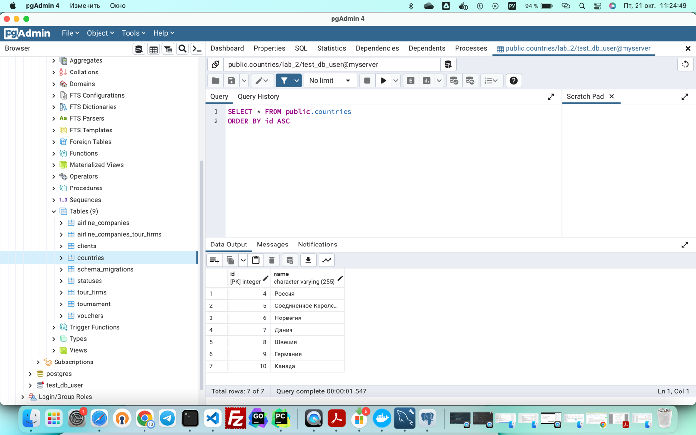

## SELECT queries

### Обычный запрос со всеми полями
```
select * from clients;

  id   | first_name | middle_name |  last_name  | phone_number | age 
-------+------------+-------------+-------------+--------------+-----
 36923 | Вольфганг  | Амадей      | Моцарт      | 123456       | 123
 36924 | Пётр       | Ильич       | Чайковский  | 123243434    |  99
 36925 | Сергей     |             | Рахманинов  | 323343534    | 108
 36926 | Мстислав   |             | Растропович | 4334353      |  90
 36922 | Дмитрий    | Алексеевич  | Сиднев      | 89176002912  |  21
```

### Запрос с простым условием

```
select * from clients where age = 21;

  id   | first_name | middle_name | last_name | phone_number | age 
-------+------------+-------------+-----------+--------------+-----
 36922 | Дмитрий    | Алексеевич  | Сиднев    | 89176002912  |  21
```
### Обычный запрос с группирующей функцией `сount(...)`


```
select count(id) from clients where age > 21;

 count 
-------
     4
```
### Запрос с `INNER JOIN`

```
select * from vouchers inner join airline_companies on vouchers.airline_company_id = airline_companies.id;

 id | country_id_in | country_id_out | client_id | firm_id | price  | status_id | date_start | date_finish | airline_company_id | id |       name       
----+---------------+----------------+-----------+---------+--------+-----------+------------+-------------+--------------------+----+------------------
  2 |             9 |              5 |     36923 |       9 |  12300 |         2 | 2022-09-17 | 2022-09-24  |                  2 |  2 | Turkish Airlines
  3 |             4 |              6 |     36924 |       8 |   8900 |         3 | 2022-10-12 | 2022-09-28  |                  2 |  2 | Turkish Airlines
  4 |             5 |              4 |     36922 |       9 | 120000 |         1 | 2022-10-01 |             |                  4 |  4 | Аэрофлот

```

### Запрос с  несколькими `INNER JOIN`

```
 select
 client_id, airline_company_id
 from vouchers inner
 join airline_companies
 on vouchers.airline_company_id = airline_companies.id
 inner join clients
 on vouchers.client_id = clients.id;

 client_id | airline_company_id 
-----------+--------------------
     36923 |                  2
     36924 |                  2
     36922 |                  4
```

## `INSERT` queries

### Простая вставка

```
insert into countries (name) values ('Канада');

select * from countries;

 id |      name      
----+----------------
  4 | Россия
  5 | Великобритания
  6 | Норвегия
  7 | Дания
  8 | Швеция
  9 | Германия
 10 | Канада
```

## `UPDATE` queries

### Простое изменение

````
update countries
set name='Соединённое Королевство Великобритании и Северной Ирландии'
where id=5;

 select * from countries;
 id |                            name                            
----+------------------------------------------------------------
  4 | Россия
  6 | Норвегия
  7 | Дания
  8 | Швеция
  9 | Германия
 10 | Канада
  5 | Соединённое Королевство Великобритании и Северной Ирландии

````
# Лаба №6

## `GROUP BY` queries

### Запрос с внутренним 

```
 select vouchers.id, country_id_in, client_id, countries.name  from vouchers inner join countries on countries.id = country_id_in;
 id | country_id_in | client_id |                            name                            
----+---------------+-----------+------------------------------------------------------------
  2 |             9 |     36923 | Германия
  3 |             4 |     36924 | Россия
  4 |             5 |     36922 | Соединённое Королевство Великобритании и Северной Ирландии
  5 |             4 |     36925 | Россия


select
    inner_injection.count, name
from 
    (select
        country_id_in, count(*) 
    from
        vouchers
    group by 
        vouchers.country_id_in)
as
    inner_injection 
inner join
    countries
on
    countries.id = inner_injection.country_id_in;
 count |                            name                            
-------+------------------------------------------------------------
     1 | Германия
     1 | Соединённое Королевство Великобритании и Северной Ирландии
     2 | Россия

```

### Запрос с `HAVING`

```
select
    inner_injection.count, name
from 
    (select
        country_id_in, count(*) 
    from
        vouchers
    group by 
        vouchers.country_id_in
    having
        count(*) = 2)
as
    inner_injection 
inner join
    countries
on
    countries.id = inner_injection.country_id_in;
    
    
 count |  name  
-------+--------
     2 | Россия

```

## `UNION` queries

```
(select id, name from countries) union (select * from statuses);
 
  id |                            name                            
----+------------------------------------------------------------
  3 | Ваще супер
  6 | Норвегия
  5 | Соединённое Королевство Великобритании и Северной Ирландии
  2 | Премиум класс
  1 | Горячая путёвка
  9 | Германия
  4 | Россия
 10 | Канада
  7 | Дания
  8 | Швеция

```

# Лаба №7 (создаём бэкап базы данных и удаляем её нахрен)

1. Делаем бэкап через систему управления `PG ADMIN`



2. Какой-то волшебник удаляет к чертям базу данных...



3. Как показывает система управления, базы данны `lab_2` - не существует...



4. Создаём её (называем так же, как в приложении или меняем название базы в конфиге для dsn)



5. Делаем restore процедуру для сохранённого бэкапа



6. Данные и таблицы восстановлены




## К вопросу о разграничении прав доступа к `CRUD` операциям

Создадим рядового пользователя и пожалуем ему титут наблюдателя на таблицу клиентов
```
test_db_user=# CREATE USER non_superuser WITH PASSWORD '12345';
CREATE ROLE

lab_2=# GRANT SELECT ON clients TO non_superuser;
GRANT
```

Проверим, как работает делегирование полномочий
```
lab_2=# \q
root@21993a4b2de6:/# psql lab_2 non_superuser

...

lab_2=> select * from clients;
  id   | first_name | middle_name |  last_name  | phone_number | age 
-------+------------+-------------+-------------+--------------+-----
 36923 | Вольфганг  | Амадей      | Моцарт      | 123456       | 123
 36924 | Пётр       | Ильич       | Чайковский  | 123243434    |  99
 36925 | Сергей     |             | Рахманинов  | 323343534    | 108
 36926 | Мстислав   |             | Растропович | 4334353      |  90
 36922 | Дмитрий    | Алексеевич  | Сиднев      | 89176002912  |  21
 36927 | f          | f           | f           | 234          |  34
(6 rows)
```
А теперь запрещённое действие - просмотр таблицы с путёвками

```
lab_2=> select * from vouchers;
ERROR:  permission denied for table vouchers
```

Подключим пользователя `non_superuser` к роли суперпользователя

```
test_db_user=# GRANT test_db_user to non_superuser;
GRANT ROLE
test_db_user=# \q
root@21993a4b2de6:/# psql lab_2 non_superuser

...

lab_2=> select * from vouchers;
 id | country_id_in | country_id_out | client_id | firm_id | price  | status_id | date_start | date_finish | airline_company_id 
----+---------------+----------------+-----------+---------+--------+-----------+------------+-------------+--------------------
  2 |             9 |              5 |     36923 |       9 |  12300 |         2 | 2022-09-17 | 2022-09-24  |                  2
  3 |             4 |              6 |     36924 |       8 |   8900 |         3 | 2022-10-12 | 2022-09-28  |                  2
  4 |             5 |              4 |     36922 |       9 | 120000 |         1 | 2022-10-01 |             |                  4
  5 |             4 |              7 |     36925 |       9 |   1234 |         2 | 2022-09-24 |             |                  1
(4 rows)
```

Теперь `non_superuser` имеет все права суперпользователя и владельца **БД**


