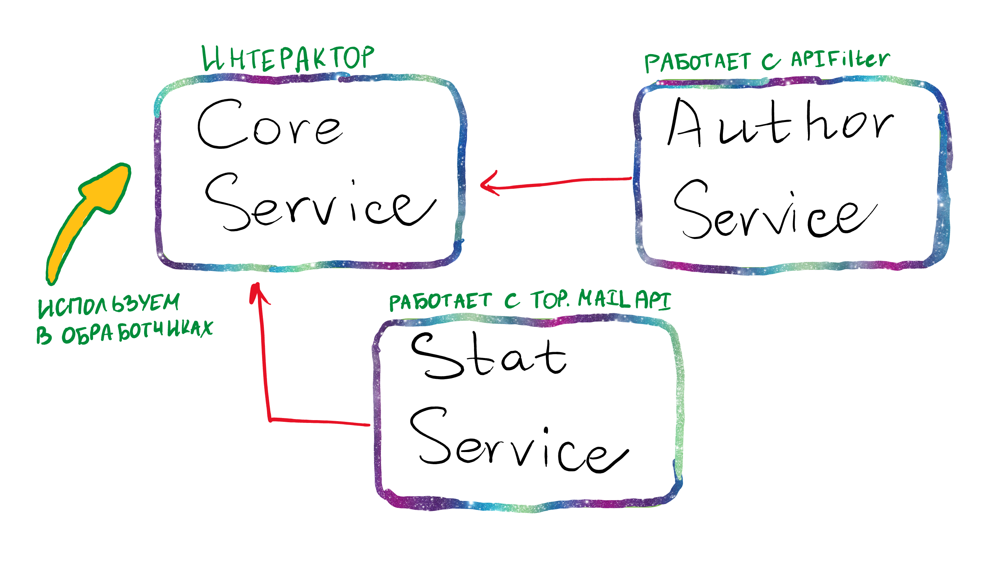
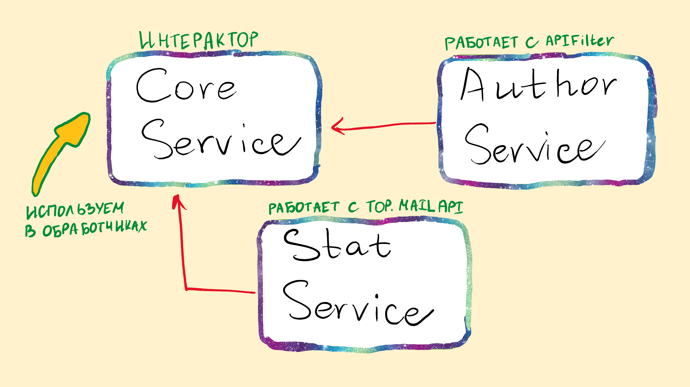

[//]: # (![alt text]&#40;static/service-architecture.png&#41;)
# API для странички TOP-10 РГ в mail новостях

## Техническое задание

[https://git.rgwork.ru/masterfront/nserver/-/issues/1#note_45852](https://git.rgwork.ru/masterfront/nserver/-/issues/1#note_45852)

## Структура

[//]: # ()


## Примеры запросов

### Статистика за месяц
```
http://[API_HOST]/rgtop10materials?datetime=last_month
```

### Статистика за неделю
```
http://[API_HOST]/rgtop10materials?datetime=last_week
```

### Статистика за текущий день
```
http://[API_HOST]/rgtop10materials?datetime=today
```

### Статистика за предыдущий день
```
http://[API_HOST]/rgtop10materials?datetime=yesterday
```